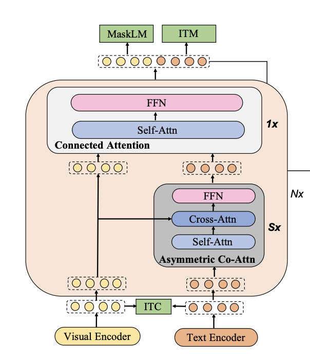
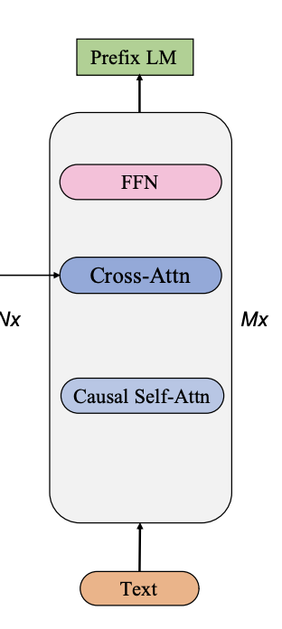
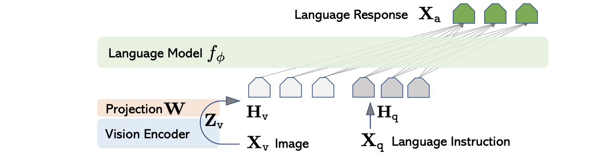

# CU OmutAI
---
## Week 11. Crosscoders and Model Tracing

#### Сравнение моделей
Сравнение проводилось по следующим пунктам:
 a) Архитектура
 b) Решаемая задача
 c) Данные в обучении
 d) Область применения
 e) Универсальность


В качестве модели до эпохи VLM была взята модель [*mPLUG*](https://arxiv.org/pdf/2205.12005) (2022).
Из моделей семества *LLaVA* была взята [*LLaVA-1.5*](https://arxiv.org/pdf/2310.03744) (2023).

**Архитектура**
***mPLUG***
Модель в общем случае представляет собой *encoder-decoder* архитектуру, разберемся с каждой ее частью последовательно.
*Encoder*
<figure>
</img>
</figure>

- В качестве визуального енкодера используется *CLIP-ViT* (*ViT-B/16* или *ViT-L/14*), предопученный на *400М* парах *изображение-текст*.  
- Для текстового енкодера используются первые 6 слоев обычного берта, а для *Skip-connected network* (*N* оранжевых блоков на изображении) – последние 6 слоев.
- Блок *Skip-connected network* содержит в себе *Asymmetric co-attention*, который состоит из *Self-Attention (SA)*,*Cross-Attention (CA)* и *FFN* слоев и работает по следующему принципу:
Пусть $l^{n-1}$ и $v^{n-1}$ – текстовые и визуальные фичи соответственно. Тогда:
```math
\begin{align}
 l^{n}_{SA} = LN(SA(l^{n-1}) + l^{n-1}) \\
 l^{n}_{CA} = LN(CA(l^{n}_{SA}, v^{n-1})) \\
 l^{n} = LN(FFN(l^{n}_{CA}) + l^{n}_{CA})
\end{align} 
где $LN$ – $LayerNorm$.
- В блоке *Connected Attention* фичи $l^{S}$ и $v^{S}$ объединяются после *S* слоев блока *Skip-connected network* и передаются в *SA* и *FFN*:
```math
\begin{align}
[v_{SA}; l_{SA}] = LN(SA([v^{S}; l^{S}]) + [v^{S}; l^{S}]) \\
[\hat{v}; \hat{l}] = LN(FFN([v_{SA}; l_{SA}]) + [v_{SA}; l_{SA}])
\end{align}
Далее фичи $\hat{v}$ и $\hat{l}$ передаются в следующий *Skip-connected block* и так *N* раз.

*Decoder*
<figure>
</img>
</figure>

- Полученные в енкодере $[\hat{v}; \hat{l}]$ после *N* слоев фичи подаются в *CA* декодера для последующей генерации ответа.

***LLaVA 1.5***
Архитектура притерпела некоторые изменения по сравнению с предыдущей версией *LLaVA*, однако некритично. Ниже представлена архитектура первой версии.
<figure>
</img>
</figure>

- В качестве визуального енкодера выступает *CLIP-ViT* (*ViT-L/14*) с увеличенным входным разрешением *336px*.
- По сравнению с первой версией однослойный линейный проектор заменили на двуслойный.
- В качестве *LLM* используется Vicuna *v1.5 13B*. 
- В остальном изменений относительно первой  версии нет.

*Вывод*

Архитектуры довольно сильно отличаются, при этом *mPLUG* выглядит более сложной с точки зрения числа различных компонент и подхода к обучению под разные задачи. Главным отличием является использование *deep fusion* подхода в *mPLUG* и *early fusion* в *LLaVA*.

**Данные в обучении**
***mPLUG***
- претрен *14M* изображений с подписями (MS COCO and Visual Genome);
- допретрен для VQA на *4M* парах изображение-текст.

***LLaVA***
- Для обучения проектора используется *600K* пар изображение-текст.

*Вывод*

Обучение *LLaVA-like* моделей не требует больших ресурсов, если имеются хорошо предобученные визуальный енкодер и *LLM*. 


**Решаемая задача**
***mPLUG***
1. *Visual Question Answering*
    (Ответы на вопросы по изображению)
2. *Image Captioning* (Описание изображения)
3. *Image-Text Retrieval* (Ретрив по картинке или тексту текста/изображения)
4. *Visual Grounding* (На основе текста и изображения локализовать указанный объект на изображении)
5.  *Visual Reasoning* (Логические и арифметические операции)

***LLaVA 1.5***
1. *Visual Question Answering*
2. *Image Captioning*
3. *Image-Text Retrieval*
4. *Object Detection*
(Поиск и локализация объектов разных классов на изображении с bounding boxes)
5. *Visual Reasoning*
6. Referring Expression Comprehension (Понимание и разрешение ссылочных выражений)
7. *Visual Commonsense Reasoning* (Отвечает на вопросы, требующие «здравого смысла» и знаний о повседневном мире, видимых на картинке)
8. *Scene Graph Generation* (Построение графа сцены: извлечение объектов и отношений между ними)
9. *OCR Text Recognition* (Распознавание и извлечение текста из изображений)
10. *Multimodal Dialogue* (Ведение диалога с пользователем, учитывая как текстовые, так и визуальные входные данные)
11. *Image-based Instruction Following* (Выполнение инструкций, связанных с тем, что изображено на картинке)

*Вывод*

Модели имеют схожие задачи, однако модель *LLaVA* имеет больше знаний о мире и способна лучше решать более сложные задачи, благодаря ллмке.


    


