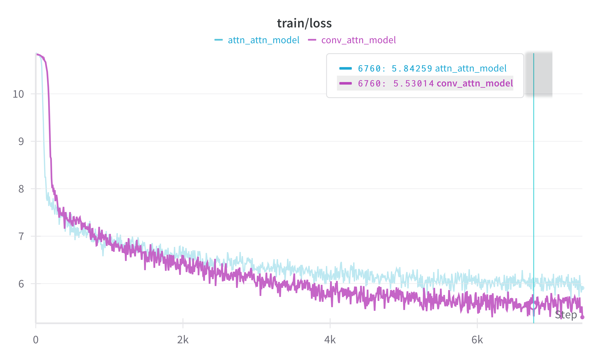
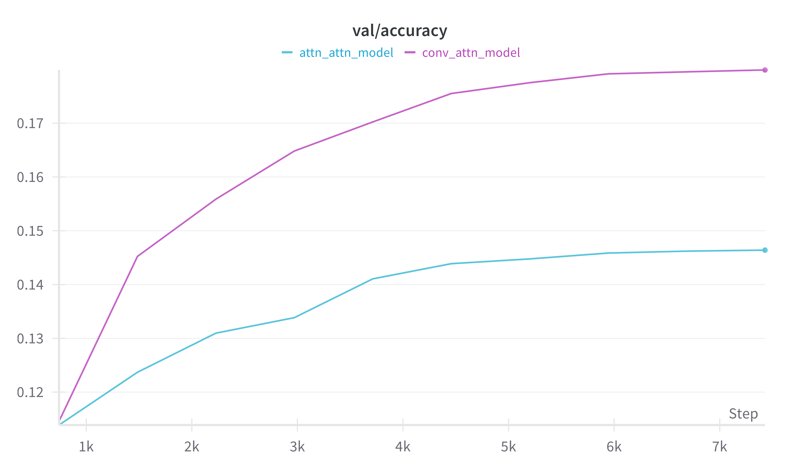

# CU OmutAI
---
## Week 6. Induction heads в архитектурах со сверткой
**Цель:**
    В этом задании вы углубите понимание концепций "smeared keys" и induction heads, представленных в статье *"In-context Learning and Induction Heads"*. Вы должны исследовать, насколько эффективно архитектуры на основе свёртки аппроксимируют поведение "smeared keys" и induction heads.

**Архитектуры моделей:**
1. *Conv-Attention model*
</img>

Реализация *pytorch*.
```python
class QKV(nn.Module):
    def __init__(self, d_model, d_k, d_v):
        super().__init__()
        self.W_Q = nn.Linear(d_model, d_k, bias=False)
        self.W_K = nn.Linear(d_model, d_k, bias=False)
        self.W_V = nn.Linear(d_model, d_v, bias=False)
        nn.init.xavier_normal_(self.W_Q.weight)
        nn.init.xavier_normal_(self.W_K.weight)
        nn.init.xavier_normal_(self.W_V.weight)
    
    def forward(self, X):
        Q = self.W_Q(X)
        K = self.W_K(X)
        V = self.W_V(X)
        return Q, K, V

class ConvAttnNet(nn.Module):
    def __init__(self, embedding_dim=512, hidden_dim=512):
        super().__init__()
        self.embeddings = nn.Embedding(num_embeddings=25000, embedding_dim=embedding_dim)
        self.register_buffer('filter_mask', torch.Tensor([1, 1, 0]))
        self.conv = nn.Conv1d(embedding_dim, embedding_dim, 3, stride=1, padding=1)
        self.qkv = QKV(embedding_dim, hidden_dim, hidden_dim)
        self.lm_head = nn.Linear(hidden_dim, 25000)

    def forward(self, input_ids, attention_mask):
        embed = self.embeddings(input_ids).permute(0, 2, 1) 
        conv_weight = self.conv.weight * self.filter_mask.view(1, 1, -1) # не смотрим в будущее
        out = F.conv1d(embed, conv_weight, bias=self.conv.bias, stride=self.conv.stride, padding=self.conv.padding)
        out = out.permute(0, 2, 1) 
        queries, keys, values = self.qkv(out)
        out = F.scaled_dot_product_attention(queries, keys, values, attn_mask=attention_mask.unsqueeze(-1).bool())
        return self.lm_head(out)
```

2. *Attention-Attention model*
</img>

Реализация *pytorch*.
```python
class AttnAttnNet(nn.Module):
    def __init__(self, embedding_dim=512, hidden_dim=512):
        super().__init__()
        self.embeddings = nn.Embedding(num_embeddings=25000, embedding_dim=embedding_dim)
        self.qkv1 = QKV(embedding_dim, hidden_dim, hidden_dim)
        self.qkv2 = QKV(embedding_dim, hidden_dim, hidden_dim)
        self.lm_head = nn.Linear(hidden_dim, 25000)

    def forward(self, input_ids, attention_mask):
        embed = self.embeddings(input_ids)
        queries, keys, values = self.qkv1(embed)
        out = F.scaled_dot_product_attention(queries, keys, values, attn_mask=attention_mask.unsqueeze(-1).bool())
        queries, keys, values = self.qkv2(out)
        out = F.scaled_dot_product_attention(queries, keys, values, attn_mask=attention_mask.unsqueeze(-1).bool())
        return self.lm_head(out)
    
```

### Постановка эксперимента 
#### Датасет
В качестве набора данных для обучения был использован *[wikitext-103-raw-v1](https://huggingface.co/datasets/Salesforce/wikitext)*, который содержит более *116М* непустых строк. 

#### Обучение
**Параметры обучения:**
>   lr = 3e-4
    epochs = 3
    scheduler = 'cosine'
    warmup_ratio = 0.1


Ниже представлены графики обучения моделей.
</img>
</img>
</img>


#### Результаты 

Приведены в отчете по ссылке.
