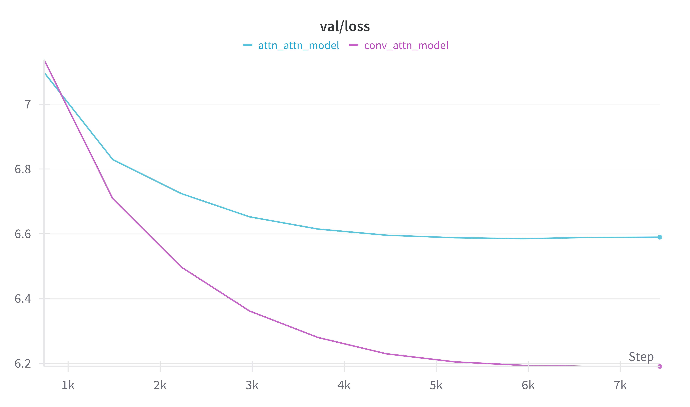

# CU OmutAI
---
## Week 6. Induction heads в архитектурах со сверткой
**Цель:**
    В этом задании вы углубите понимание концепций "smeared keys" и induction heads, представленных в статье *"In-context Learning and Induction Heads"*. Вы должны исследовать, насколько эффективно архитектуры на основе свёртки аппроксимируют поведение "smeared keys" и induction heads.

**Архитектуры моделей:**
1. *Conv-Attention model*
<figure>
</img>
</figure>

Реализация *pytorch*.
```python
class QKV(nn.Module):
    def __init__(self, d_model, d_k, d_v):
        super().__init__()
        self.W_Q = nn.Linear(d_model, d_k, bias=False)
        self.W_K = nn.Linear(d_model, d_k, bias=False)
        self.W_V = nn.Linear(d_model, d_v, bias=False)
        nn.init.xavier_normal_(self.W_Q.weight)
        nn.init.xavier_normal_(self.W_K.weight)
        nn.init.xavier_normal_(self.W_V.weight)
    
    def forward(self, X):
        Q = self.W_Q(X)
        K = self.W_K(X)
        V = self.W_V(X)
        return Q, K, V

class ConvAttnNet(nn.Module):
    def __init__(self, embedding_dim=384, hidden_dim=384):
        super().__init__()
        self.embeddings = nn.Embedding(num_embeddings=tokenizer.vocab_size, embedding_dim=embedding_dim)
        self.register_buffer('filter_mask', torch.tensor([1, 1, 0], dtype=torch.bool))
        self.conv = nn.Conv1d(embedding_dim, embedding_dim, 3, stride=1, padding=1)
        self.qkv = QKV(embedding_dim, hidden_dim, hidden_dim)
        self.lm_head = nn.Linear(hidden_dim, tokenizer.vocab_size)

    def forward(self, input_ids, attention_mask):
        embed = self.embeddings(input_ids).permute(0, 2, 1).contiguous() 
        conv_weight = self.conv.weight.data * self.filter_mask # не смотрим в будущее
        out = F.conv1d(embed, conv_weight, bias=self.conv.bias, stride=self.conv.stride, padding=self.conv.padding)
        out = out.permute(0, 2, 1).contiguous() 
        queries, keys, values = self.qkv(out)
        out = F.scaled_dot_product_attention(queries, keys, values, is_causal=True)
        return self.lm_head(out)
    
```

2. *Attention-Attention model*
<figure>
</img>
</figure>

Реализация *pytorch*.
```python
class AttnAttnNet(nn.Module):
    def __init__(self, embedding_dim=384, hidden_dim=384):
        super().__init__()
        self.embeddings = nn.Embedding(num_embeddings=tokenizer.vocab_size, embedding_dim=embedding_dim)
        self.qkv1 = QKV(embedding_dim, hidden_dim, hidden_dim)
        self.qkv2 = QKV(embedding_dim, hidden_dim, hidden_dim)
        self.lm_head = nn.Linear(hidden_dim, tokenizer.vocab_size)

    def forward(self, input_ids, attention_mask):
        embed = self.embeddings(input_ids)
        queries, keys, values = self.qkv1(embed)
        out = F.scaled_dot_product_attention(queries, keys, values, is_causal=True)
        queries, keys, values = self.qkv2(out)
        out = F.scaled_dot_product_attention(queries, keys, values, is_causal=True)
        return self.lm_head(out)
```

### Постановка эксперимента 
#### Датасет
В качестве набора данных для обучения был использован *[wikitext-2-raw-v1](https://huggingface.co/datasets/Salesforce/wikitext)*, который содержит более *23K* непустых строк. 

#### Обучение
**Параметры обучения:**
>   lr = 3e-4
    epochs = 10
    scheduler = 'cosine'
    warmup_ratio = 0.1


Ниже представлены графики обучения моделей.
<figure>
</img>
</figure>

<figure>
</img>
</figure>

<figure>
</img>
</figure>


### Результаты
---
#### Smeared keys

Проанализируем веса полученных фичей сверток. 
Мы наблюдаем меньшее значение фичей в третьем канале, что логично с учетом маскирования этого канала. 
В поканальном разрезе статистики активаций приведены в таблице. 
| Channel| max | min | q75 | q90 |
| ---- | --- | --- | ---- | --- | 
| ch. 1  |0.133| -0.135| 0.019| 0.037|
| ch. 2  | 0.185 |-0.196| 0.029|0.055|
| ch. 3    | 0.023|-0.023| 0.011 | 0.018|

Ниже представлены изображения по каждому из каналов. 
<figure>
</img>
</figure>

<figure>
</img>
</figure>

<figure>
</img>
</figure>

Посмотрим на активации весов в фильтрах, для наглядности, ограничимся четырьмя. Для контрастности значений, будем смотреть на абсолютные значения.
Мы видим, что помимо того, что по третьему каналу *future* значения ниже, чем в других каналах, есть явное влияние первого канала *pred* и второго канала *current* на фичи внутри окна свертки, что говорит о неком «подмешивании» предыдущего значения с весом *pred* на текущую позицию внутри окна. При этом, значения *pred* немного, но меньше значений *current*, что говорит о том, что текущая фича будет учтена важнее предыдущей.
<figure>
</img>
</figure>

<figure>
</img>
</figure>

<figure>
</img>
</figure>

<figure>
</img>
</figure>

Эти примеры явно показывают, что <u>архитектуры, на основе свертки могут аппроксимировать поведение *smeared keys*</u>.

#### Induction head

Визуализируем полученные attention-карты и попытаемся понять, какой из подходов лучше смог захватить поведение *induction head*.

Для этого мы будем работать со следующим текстом:
> Mr and Mrs Dursley, of number four, Privet Drive, were proud to say that they were perfectly normal, thank you very much. They were the last people you'd expect to be involved in anything strange or mysterious, because they just didn't hold with such nonsense. Mr and Mrs Dursley, of number four, Privet Drive, were proud to say that they were perfectly normal, thank you very much.

Важно отметить, что в нем повторяется первое и последнее предложение.

**Conv-Attn Model**

<figure>
</img>
</figure>

**Attn-Attn Model**

<figure>
</img>
</figure>

Исходя из полученных матриц аттеншна мы можем сделать вывод, что в архитектуре *Conv-Attn* внимание на повторяющемся предложении концентрируется сильнее, чем у архитектуры *Attn-Attn* (что соответствует *Argument 2 (Macroscopic co-perturbation)* из статьи).
 У *Attn-Attn* мы можем наблюдать много других активаций, возникновение которых может быть объяснено *Argument 4 (Specific examples of induction head generality)* из статьи.