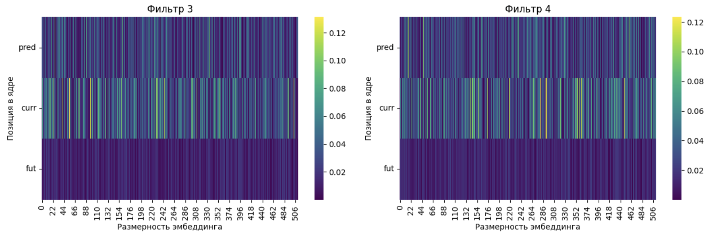
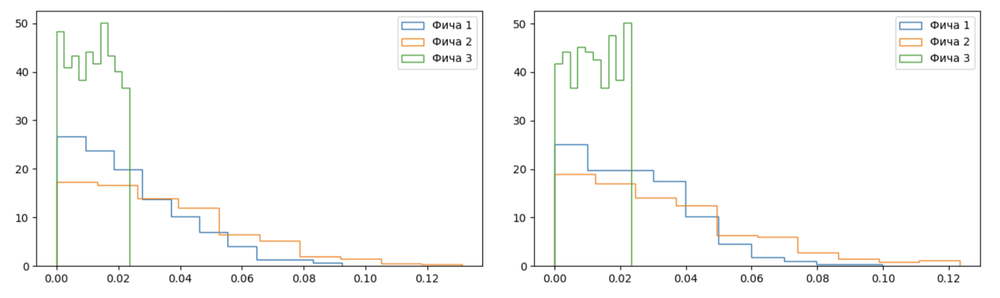

## Результаты
---
#### Smeared keys

Проанализируем веса полученных фичей сверток. 
Мы наблюдаем меньшее значение фичей в третьем канале, что логично с учетом маскирования этого канала. 
В поканальном разрезе статистики активаций приведены в таблице. 
| Channel| max | min | q75 | q90 |
| ---- | --- | --- | ---- | --- | 
| ch. 1  |0.133| -0.135| 0.019| 0.037|
| ch. 2  | 0.185 |-0.196| 0.029|0.055|
| ch. 3    | 0.023|-0.023| 0.011 | 0.018|

Ниже представлены изображения по каждому из каналов. 
<figure>
</img>
</figure>

<figure>
</img>
</figure>

<figure>
</img>
</figure>

Посмотрим на активации весов в фильтрах, для наглядности, ограничимся четырьмя. Для контрастности значений, будем смотреть на абсолютные значения.
Мы видим, что помимо того, что по третьему каналу *future* значения ниже, чем в других каналах, есть явное влияние первого канала *pred* и второго канала *current* на фичи внутри окна свертки, что говорит о неком «подмешивании» предыдущего значения с весом *pred* на текущую позицию внутри окна. При этом, значения *pred* немного, но меньше значений *current*, что говорит о том, что текущая фича будет учтена важнее предыдущей.
<figure>
</img>
</figure>

<figure>
</img>
</figure>

<figure>
</img>
</figure>

<figure>
</img>
</figure>

Эти примеры явно показывают, что <u>архитектуры, на основе свертки могут аппроксимировать поведение *smeared keys*</u>.

#### Induction head
