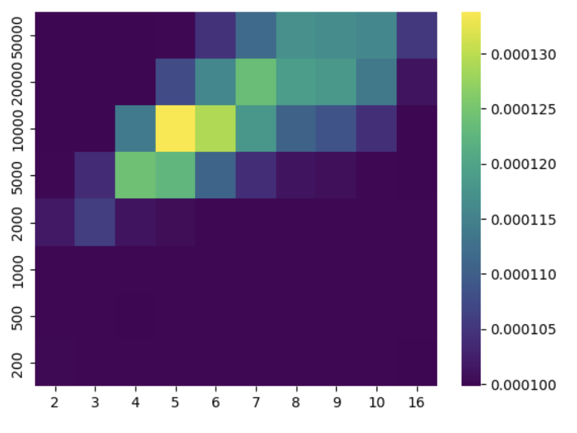
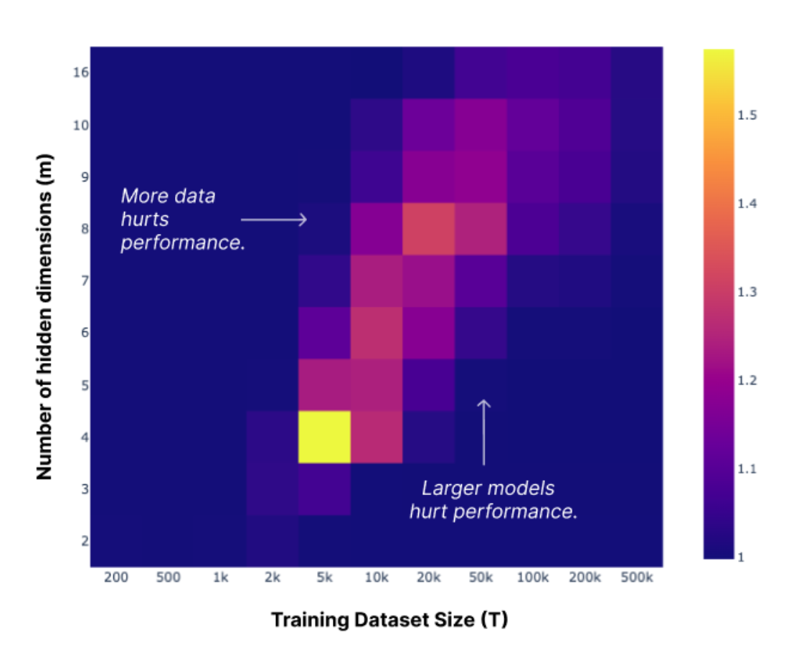

# CU OmutAI
---
## Week 7. SoLU and superposition. 
**Цель:**
    Необходимо обучить “игрушечные” ReLU модели, которые описаны в [блогпосте](https://transformer-circuits.pub/2023/toy-double-descent/index.html) и зарепродьюсить графики, показывающие наличие “double descent” во время их обучения. 

**Постановка**
Из статьи была взята следующая *Toy model*.
```python
class ReluModel(nn.Module):
    def __init__(self, input_dim=10000, hidden_dim=2):
        super().__init__()
        self.W = nn.Parameter(torch.zeros(hidden_dim, input_dim))
        self.bias = nn.Parameter(torch.zeros(input_dim))
        nn.init.xavier_uniform_(self.W)
    
    def forward(self, x):
        h = torch.matmul(x, self.W.t()) 
        x_ = torch.relu(torch.matmul(h, self.W) + self.bias)
        return x_
```

### Результаты
Эффект *double descent* достигается на определенных значениях *T* размера датасета и *m* размера хидден слоя, при которых размер датасета схож с числом параметров модели.

В качестве возможных размеров m и T были взяты следующие:
$m = [2,3,4,5,6,7,8,9,10,16]$;
$T = [200, 500, 1000, 2000, 5000, 10000, 20000, 50000]$.

Было обучено $m \cdot T$ моделей и получены средние значения лоссов. 
Получился следующий график:  

<figure>
</img>
</figure>

Как можно заметить, начиная с $T=2000$ и при увеличении *m*,
ошибка сначала остается минимальной, но затем начинает увеличиваться. И начиная с некоторого *m* опять уменьшается. Результат получился схожим с результатами статьи.

График из статьи:
<figure>
</img>
</figure>


