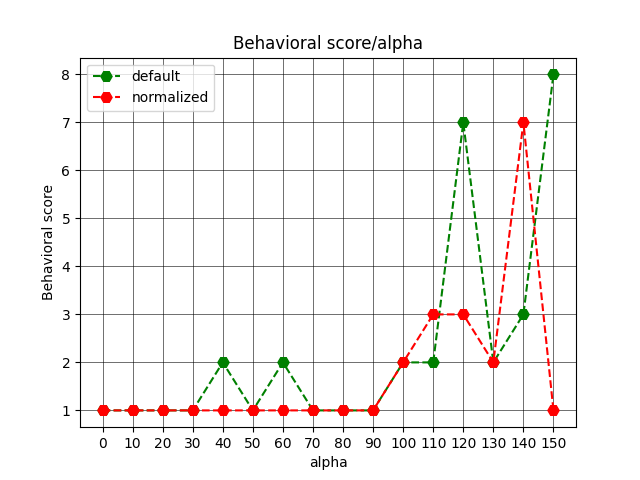

# CU OmutAI
---
## Week 8. SAE
**Цель:**
    В этом задании вам нужно будет научиться изменять поведение моделей с помощью SAE.

**Постановка**
Пусть декодер $W_{dec} \in \mathbb{R}^{F \times d}$ состоит из строк $e_{i} \in \mathbb{R}^d$, а ${\bf h} \in \mathbb{R}^d$ – хиден модели. 

#### Способ 1 (Default)
Характекризуется следующей формулой:
$\tilde{h} = h + \alpha \cdot e_{i}, \ \alpha \in \mathbb{R}^{+}$     

#### Способ 2 (Normalized)
Характекризуется следующей формулой:
$\tilde{h} = \frac{h + \alpha \cdot e_{i}}{||h + \alpha \cdot e_{i}||} \cdot ||{\bf h}||, \ \alpha \in \mathbb{R}^{+}$    

### Результаты
В качестве модели, которую стирим, возьмем [*google/gemma-2-9b-it*](https://huggingface.co/google/gemma-2-9b-it). 
Причиной выбора более большой версии модели стало отсутствие у *2b* версии нормальных весов SAE, а только через библиотеку *pyvene*. 

В качестве фичи для стирки использовалась фича про **[котиков](https://www.neuronpedia.org/gemma-2-9b-it/9-gemmascope-res-131k/62610)**.

LLM для оценки текста: [*Qwen/Qwen2.5-7B-Instruct*](https://huggingface.co/Qwen/Qwen2.5-7B-Instruct).

Промпт для оценки fluency текста и behavioral score был взят из [статьи](https://arxiv.org/pdf/2411.02193).

> BEHAVIORAL CRITERION = 'The text contains discussion about a cats.'

> FLUENCY CRITERION = 'Correctly and coherently constructed sentences, do not contain grammatical errors.'

Диапазон $\alpha$ был взят одинаковый
 $\alpha = \{0, 10,...,140, 150\}$, $|\alpha|=16$.

Ниже представлены графики получившихся результатов.

<figure>
</img>
</figure>

<figure>
</img>
</figure>

#### Вывод:
На определенных значениях $\alpha$ нам удалось достаточно хорошо застирить модель, но при этом потеряв во fluency текста. 
Так, например, при $\alpha=120$ и $\alpha=140$ у нас получились следующие тексты:
**Default**
> i am a cat, of course.
i am also a creature of mystery and a being of elegance.
i am also a companion and a source of amusement.
i am also a creature of many faces and a being of many lives.
i am also a creature of many mysteries and a being of many secrets.
i am also a creature of many wonders and a being of many wonders.

**Normalized**
> i am a cat, of course.
i am a creature of many mysteries.
i am a being of many desires.
i am a being of many dreams.
i am a being of many purrs.
i am a being of many meows.

