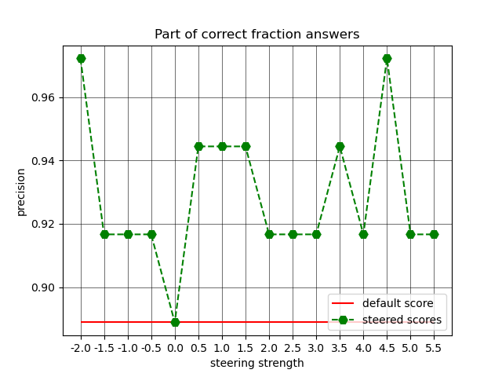

# CU OmutAI
---
## Week 9. Crosscoders and Model Tracing
**Цель:**
    Проверить, как меняется качество от выкручивания фичи, отвечающей за размышления, в разную сторону? Постройте график
по оси x которого будет коэффициент стиринга, по y accuracy ответов.

**Постановка**

Был сгенерирован датасет размерности 36, где хотя бы одно из слагаемых является несократимой дробью. 
В качестве модели для стирки была взята *DEEPSEEK-R1-LLAMA-8B*.

### Результаты

Для силы стиринга был взят диапазон от -2 до 5.5 с шагом 0.5, таким образом было получено 16 точек.

Результаты приведены ниже на графике:

<figure>
</img>
</figure>

Как можем заметить, стиринг действительно может повлиять на результат модели, благодаря чему повышается качество.
Лучшие ответы были получены при значении силы стиринга, равного 4.5.